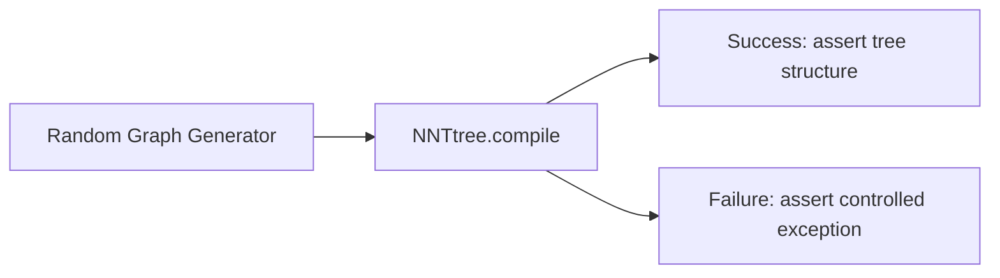

> **Archived:** historical implementation record; not authoritative current documentation.

# Fuzzy Testing — Design Specification

**Date**: 2026-07-04  
**Status**: Draft  
**Author**: NNModelling Architect

---

## 1. Objective

Systematically validate NNModelling invariants through randomized input generation, complementing existing deterministic tests. Four invariants — four fuzzers — zero overlap with existing unit tests.

---

## 2. Fuzzers

### Fuzzer #1 — Graph Compilability (TypeScript, `fast-check`)

Generate random graphs (nodes + edges) from real stereotypes; verify NNTree compiler invariants.



**Generators:**

- `arbitraryNode`: picks a random stereotype from `Stereotypes/`, assigns random position, random ID
- `arbitraryEdge`: picks two random nodes, respects handle cardinality (source unlimited, target ≤1)
- `arbitraryGraph`: generates 1 Input + 1 Loss + N random intermediate nodes (N ∈ [0, 15]), then K random edges creating a DAG with probabilitá decrescente a distanza

**Invariant:** For every diagram with exactly 1 Input + 1 Loss:
- `tree.nodes` references are valid
- `tree.lossNode` is present with correct `taskType`
- Subflow inner graphs are acyclic
- No orphan children
- No exception other than `Error` subclasses

**Non-invariant (deliberately not checked):**
- Top-level graph cycle detection (warns, doesn't throw)
- Hidden nodes (UI-only, inert at NNTree level)
- Empty subflows (warns, compiles)

### Fuzzer #2 — Forward Pass (TypeScript orchestrates Python, `fast-check` + subprocess)

Generate NNTree JSON with realistic parameters and compatible shapes; verify Python pipeline end-to-end.

```
arbitraryShapeCompatibleParams -> NNTree JSON -> convert.py -> Hydra -> Net.forward() -> warm
```

**Key constraint:** Shape propagation must be consistent. For each generated graph:
1. Assign input shape based on dataset (MNIST: `[1, 28, 28]`, etc.)
2. Propagate shape through graph using simplified shape inference (Conv2d → spatial dims divide, Linear → feature dim matches)
3. Reject parameter combinations that provably mismatch (avoid wasting runs)
4. Generate NNTree JSON → run `convert.py` → load `Net` → `forward(randn(input_shape))`

**Invariant:**
- `convert.py` exits 0, all 7 YAML files created
- `Net.forward()` returns non-empty tensor
- `tensor.isfinite().all()` — no NaN/Inf
- `loss.backward()` succeeds, gradients exist for all trainable parameters

### Fuzzer #3 — Serialization (TypeScript, `fast-check`)

Random sequence of `export → import → export` [sic] cycles.

```
arbitraryDiagram -> export (JSON) -> import (JSON) -> export' (JSON') -> assert deepEqual(JSON, JSON')
```

**Invariant:** After any number of round-trips (N ≥ 1), the exported JSON is structurally identical:
- Same node IDs, positions, params, colors
- Same edge IDs, source, target, handles
- Same subflow parent/child relationships

**Edge cases automatically explored:** empty diagram, single node, disconnected nodes, subflows with internal nodes, subflows with empty internals, nodes with all param types (int/float/bool/None/list/dict).

### Fuzzer #4 — Operation Commutativity (TypeScript, `fast-check`)

Random sequences of DiagramCore mutations; verify graph consistency after each step.

```
arbitraryOpSequence -> DiagramCore -> apply ops one-by-one -> after each: assert consistency
```

**Operations with random parameters:**
- `addModule(stereotype, position, config?)`
- `deleteNodes(nodeIds)`
- `addEdge(source, target)`
- `moveNode(id, x, y)`
- `updateModule(id, params)`
- `toggleSubflow(id)`

**Invariant (after EVERY operation):**
- All edge source/target node IDs exist in `diagram.nodes`
- All `parentId` references exist
- `diagram.nodes` has no duplicate IDs
- No self-loop edges
- `getGraph()` and `getSnapshot()` never throw
- Undo reverts to previous consistent state; redo restores current

**Special rules:**
- `deleteNodes` on a node with edges: edges are removed too (tested implicitly by the all-edges-reference-valid-nodes check)
- `addEdge` on occupied target handle: rejected (valid return false, not thrown)

---

## 3. Implementation Plan

### Phase 1 (TypeScript, ~150 lines)

Install `fast-check` in front-end, implement Fuzzers #1, #3, #4.

```bash
cd front-end && pnpm add -D fast-check
```

Files:
- `front-end/src/__tests__/fuzz/arbitraries.ts` — generators (graphs, operations, params)
- `front-end/src/__tests__/fuzz/compilability.test.ts` — #1
- `front-end/src/__tests__/fuzz/serialization.test.ts` — #3
- `front-end/src/__tests__/fuzz/operations.test.ts` — #4

### Phase 2 (TypeScript + Python, ~200 lines)

Implement Fuzzer #2.

Files:
- `front-end/src/__tests__/fuzz/forwardPass.test.ts` — #2
- `front-end/src/__tests__/fuzz/shapePropagation.ts` — shape inference helper

### Running

```bash
cd front-end && pnpm test                  # existing unit tests (95) unchanged
cd front-end && pnpm vitest run fuzz/       # fuzz tests only
cd front-end && pnpm vitest run fuzz/ --reporter=verbose  # with seed for reproduction
```

`fast-check` prints failing seed automatically: `npx vitest --seed=<seed>` to reproduce.

---

## 4. Success Criteria

- 4 fuzzers running in CI alongside existing tests
- No flaky failures (run each fuzzer 10x before shipping)
- Each fuzzer exercises ≥1000 random inputs per run
- Zero existing tests removed or modified
