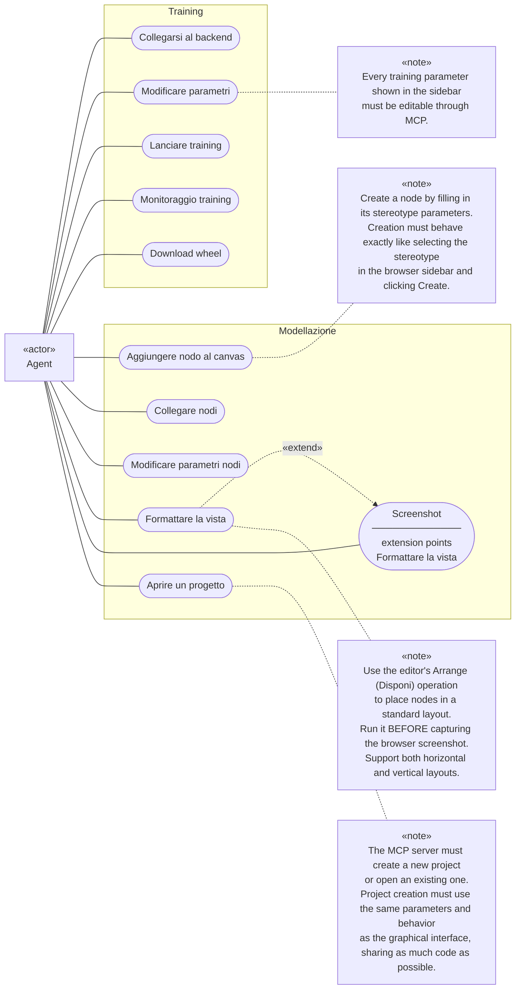

# MCP use-case parity with the editor

## Context and authority

The MCP interface must expose the agent-facing modeling and training workflows
below, not merely a collection of low-level graph and HTTP operations. This is
an accepted functional constraint, not a claim that the server already
implements it. The [browser-backed MCP architecture](../architecture/browser-mcp.md)
describes actual implementation and gaps separately. The
[adaptation plan](../../plans/active/mcp-use-case-parity/plan.md) maps these
requirements to implementation tasks and verification gates; its existence does
not mean the server already satisfies this constraint.

The diagram preserves the user-supplied use cases, associations, extension and
notes. `Agent` is the single primary actor. The two groups are capability areas,
not separate agent roles, permission levels, or execution processes.
The actor is directly associated with every use case, including Screenshot
and Open a project; these associations coexist with the layout extension.

## Accepted diagram

## Required observable behavior

| ID | Use case | Constraint |
|---|---|---|
| T1 | Connect to backend | The agent can establish the authorized backend connection needed by the training workflow. Existing pairing approval and job ownership still apply. |
| T2 | Edit training parameters | Every training parameter exposed by the sidebar is configurable through MCP with equivalent meaning and validation. Sending an opaque job JSON alone does not demonstrate sidebar parity. |
| T3 | Launch training | The agent can launch training for the modeled diagram with the chosen configuration, including the preparation and resource transfer required by the backend. |
| T4 | Monitor training | The agent can observe the submitted job's progress, status and diagnostics. |
| T5 | Download wheel | The agent can retrieve the generated wheel for its authorized job, not merely its path or manifest. |
| M1 | Add node | Instantiate an existing stereotype with its parameters, defaults and applicable options through the same domain behavior as sidebar selection and Create. This is not authoring a new stereotype package. |
| M2 | Connect nodes | Connect live diagram nodes with the same handle and graph constraints as the editor. |
| M3 | Edit node parameters | Read and change stereotype parameter values without losing their declared types or the editor's semantics. |
| M4 | Format view | Apply the editor's **Disponi** auto-layout in either horizontal or vertical direction. Panning, zooming, fitting the viewport, or manually guessing node coordinates are not equivalent. |
| M5 | Screenshot | Capture the browser diagram after the required layout has been applied and rendered. |
| M6 | Open a project | Create a new project or open an existing one through the browser's shared project workflow. Creation exposes the same form parameters, defaults, validation and behavior as the UI; opening activates the same writable project and resource scope. |

The original `«extend»` relation is retained faithfully. Its note explicitly
requires layout **before** screenshot; this ordering is the acceptance rule,
not permission to silently skip layout. A future UML notation cleanup must not
weaken that rule. These are use-case relationships, not a prescribed one-tool-
per-oval API or a call graph.

## Thin proxy and shared browser logic

The MCP server is a small proxy to the browser, not a second implementation of
the editor. Maximize reuse of the browser's domain code: UI actions and MCP
requests must reach the same project, node, parameter, layout and training
operations wherever those behaviors already exist. Extract a narrow shared
operation when needed instead of copying its logic into a tool handler.

The server should primarily adapt tool inputs/outputs, route requests and
report transport errors. Protocol validation belongs at that boundary; domain
defaults, validation and workflow behavior belong to the shared browser
services. Browser-only capabilities stay behind their existing adapters, and
training execution stays on the backend. Code sharing must not introduce a
second graph, filesystem owner or scheduler into MCP.

## Project creation and opening

The single use case M6 includes both **New project** and **Open project**. New
project accepts the UI's `id`, `version`, `name` and optional `description`,
using the same defaults and validation rather than accepting an unrelated raw
model JSON contract. Its parent-directory selection, child creation and
collision handling follow the
[project-workspace decision](../decisions/project-workspaces-and-stereotype-authoring.md).
Opening reads the existing project's model and declared resources, activates
the same scope and retains the normal ordered autosave behavior.

Directory permission, cancellation, invalid project and existing-directory
errors must remain visible. Browser filesystem handles stay in the browser;
they are not MCP payloads or backend inputs. If the browser requires a user
gesture or permission grant, expose that required interaction without claiming
the project is already open or bypassing the permission boundary. The exact
tool/permission handshake remains an API design choice, not permission to make
a second server-side project loader.

## Preserved boundaries

- Live graph mutations remain owned by the browser's `DiagramCore`; do not
  implement a second graph or an independent layout algorithm in MCP.
- Shared domain behavior does not require driving DOM clicks. The UI and MCP
  may call the same domain operation while preserving the same visible result.
- Backend authentication, approval and ownership remain governed by
  [pairing](../contracts/pairing.md). This decision does not authorize bypassing
  an administrator's approval or broadening an agent's permissions.
- Training and wheel generation remain backend responsibilities; the MCP
  interface must bridge the workflow, not duplicate the scheduler or runtime.
- Existing additional tools are not forbidden by this diagram. Their presence
  does not compensate for a missing required use case, and this decision does
  not authorize removing them.

## Verification and unresolved API choices

Acceptance requires exercising each use case through the public MCP interface,
creating and reopening projects through the same UI domain behavior, comparing
node creation/parameter values with the sidebar, checking both layout
directions and the resulting screenshot, and completing an authorized training
job through wheel retrieval. A registered tool or passing proxy mock is not
proof of end-to-end parity.

Tool names, grouping, project permission handshakes, configuration persistence, connection routing and the
wheel delivery representation remain implementation design choices. They must
be settled without changing the required user-visible behavior or introducing
a second authority for browser/backend state.
