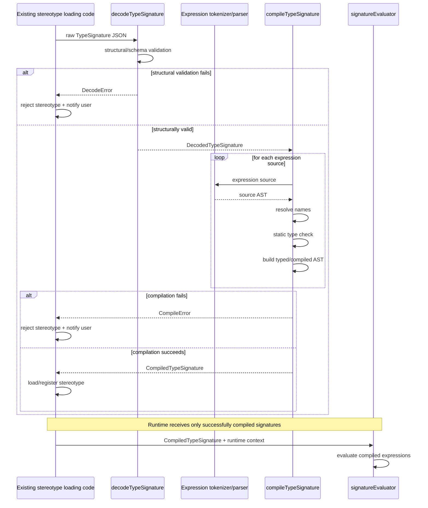

# Compile-Time Architecture

> **Status:** Draft design specification  
> **Scope:** Loading, validation, parsing, static type checking, compilation, and runtime boundary for declarative `TypeSignature`s.

## 1. Purpose

A `TypeSignature` is authored and stored in serialized form, but runtime inference must never depend directly on expression source strings.

The system therefore separates two representations:

```text
Serialized TypeSignature
        ↓
Decoded TypeSignature
        ↓
Compiled TypeSignature
```

The compile-time pipeline must validate the serialized structure, parse every expression, resolve names, statically type-check every expression, and produce a compiled representation suitable for runtime evaluation.

After successful compilation, runtime code evaluates only compiled expressions.

## 2. Architectural boundary

The central invariant is:

> **Runtime evaluation must never parse, recompile, or type-check expression source.**

Expression source strings belong exclusively to the serialized representation.

The runtime evaluator consumes only a successfully compiled `TypeSignature`.

Conceptually:

```text
JSON
 ↓
decodeTypeSignature(...)
 ↓
DecodedTypeSignature
 ↓
compileTypeSignature(...)
 ↓
CompiledTypeSignature
 ↓
Runtime evaluation
```

## 3. Representations

### 3.1 Serialized TypeSignature

The serialized representation is the form stored in stereotype JSON files.

It contains:

- input-group declarations;
- symbol declarations;
- shape patterns;
- parameter references;
- constraint expression source;
- dtype expression source;
- output-shape expression source;
- other declarative configuration.

Expressions are stored as human-readable source strings.

### 3.2 Decoded TypeSignature

`decodeTypeSignature(...)` performs structural decoding and schema validation.

Its output represents structurally valid data, but expression strings have not yet necessarily been proven semantically valid.

Responsibilities include:

- required-field validation;
- primitive field types;
- enum values;
- input-group structure;
- cardinality structure;
- symbol declaration structure;
- presence and shape of expression source fields.

Structural failures produce a load-time diagnostic.

### 3.3 Compiled TypeSignature

`compileTypeSignature(...)` transforms a successfully decoded signature into the runtime representation.

A `CompiledTypeSignature` contains compiled, typed expressions rather than expression source strings.

It must contain enough information for runtime evaluation without calling:

- the tokenizer;
- the parser;
- the static type checker;
- the expression compiler.

The compiled representation exists only in memory.

It is not serialized back into stereotype JSON.

## 4. Two explicit entry points

The loading architecture must expose two distinct conceptual operations:

```text
decodeTypeSignature(raw)
compileTypeSignature(decoded)
```

They have different responsibilities.

### `decodeTypeSignature(raw)`

Answers:

> Is this serialized structure well formed?

### `compileTypeSignature(decoded)`

Answers:

> Is this well-formed signature semantically valid and statically executable?

This separation makes the serialized-to-compiled boundary explicit and prevents structural validation from being confused with expression compilation.

## 5. Expression compilation pipeline

For every expression source contained in the decoded signature:

```text
source string
    ↓
tokenization
    ↓
source AST
    ↓
name resolution
    ↓
static type checking
    ↓
typed / compiled AST
```

The source AST and compiled AST are distinct conceptual representations.

The compiled representation must preserve all semantic information required at runtime, including:

- resolved parameter references;
- resolved input-group references;
- resolved symbol references;
- symbol scope information;
- statically known result type;
- resolved function/operator identity;
- typed lambda parameter and result types.

The runtime evaluator must not reconstruct this information from strings.

## 6. Contextual expected types

Expressions are compiled with an expected result type determined by their use site.

Examples:

```text
TypeConstraint.condition -> Bool
ComputedDimension.expr   -> Dimension
ComputedShape.expr       -> Shape
InputGroup dtype rule    -> DType-compatible result
Output dtype expression  -> DType
```

If an expression is syntactically valid but returns the wrong static type, `compileTypeSignature(...)` fails.

Example:

```text
rank(inputs.main[0])
```

has type:

```text
Int
```

and therefore cannot compile as a `TypeConstraint.condition`, which requires `Bool`.

## 7. Compile-time validation responsibilities

`compileTypeSignature(...)` must reject at least:

- undeclared symbol references;
- duplicate or conflicting symbol declarations;
- duplicate input-group names;
- invalid cardinalities;
- more than one variadic input group;
- unknown parameter references;
- unknown input-group references;
- invalid operators;
- invalid function calls;
- wrong argument types;
- invalid lambda input/output types;
- invalid spread types;
- wrong expression result type for its context;
- statically invalid dtype expressions;
- statically invalid shape expressions;
- constraints whose result type is not `Bool`.

Any error detectable from the signature definition and known declarations must fail here.

It must not be deferred to runtime.

## 8. Load-time behaviour

Compilation happens when stereotype JSON is loaded.

The flow is:

```text
load stereotype JSON
        ↓
decode TypeSignature
        ↓
compile TypeSignature
        ↓
register/load stereotype only if compilation succeeds
```

If decoding or compilation fails:

- the stereotype is **not loaded**;
- the failure must be clearly reported to the user;
- the diagnostic should identify the stereotype and the failing declaration/expression.

An invalid signature must never enter runtime inference.

## 9. Runtime boundary

After successful compilation, the runtime evaluator receives:

```text
CompiledTypeSignature
runtime inputs
normalized parameters
symbol environments
```

and evaluates the already-compiled representation.

The runtime evaluator may return:

```text
Value
Deferred
Error
```

according to the Evaluation Semantics specification.

It must not produce static type errors.

It must not invoke expression parsing or compilation.

## 10. Sequence diagram



## 11. Relationship to the current codebase

The current implementation already contains responsibilities corresponding to this architecture:

```text
type-system/schema.ts
    structural TypeSignature handling

expr/tokenizer.ts
expr/parser.ts
    expression parsing

expr/typed.ts
    expression compilation / static typing

type-system/signatureEvaluator.ts
    runtime TypeSignature evaluation
```

The design does not require these responsibilities to remain in exactly these files.

The important requirement is the architectural boundary:

```text
serialized / decoded world
        ↓
compile-time boundary
        ↓
compiled runtime world
```

The runtime evaluator must consume the compiled world only.

## 12. Forbidden architecture

The following behaviour is explicitly forbidden:

```text
decode signature
    ↓
validate expression by compiling it
    ↓
discard compiled result
    ↓
store original expression string
    ↓
runtime evaluator recompiles expression
```

In particular:

> `signatureEvaluator` must not call expression parsing or expression compilation.

A compiled expression must be produced once during stereotype loading and reused during runtime evaluation.

## 13. Error ownership

### Decode errors

Produced by malformed serialized structure.

Examples:

```text
missing required field
invalid enum
wrong JSON type
invalid cardinality representation
```

### Compile errors

Produced by semantically invalid but structurally valid signatures.

Examples:

```text
unknown symbol
unknown parameter
wrong expression type
invalid function application
invalid lambda result type
multiple variadic input groups
```

### Runtime errors

Produced only by actual runtime values or graph state.

Examples:

```text
invalid parameter value
symbol conflict
index out of bounds
constraint violation
dtype mismatch
```

Static errors must never be rediscovered at runtime.

## 14. Diagnostics

If a stereotype fails decoding or compilation, the user must receive a clear diagnostic.

A diagnostic should contain enough context to identify:

- the stereotype;
- the signature field or expression;
- whether the failure occurred during decoding or compilation;
- the underlying reason.

For expression failures, source-location information should be preserved where practical.

The exact UI representation is outside the scope of this document.

## 15. Design invariants

1. TypeSignature compilation occurs when stereotype JSON is loaded.
2. `decodeTypeSignature` and `compileTypeSignature` are distinct operations.
3. Structural validation happens before semantic compilation.
4. Expression parsing happens only during compilation.
5. Static expression type checking happens only during compilation.
6. Serialized expression strings are not needed after successful compilation.
7. Source AST and compiled/typed AST are distinct conceptual representations.
8. `CompiledTypeSignature` exists only in memory.
9. Invalid TypeSignatures are not loaded.
10. Load failures are clearly reported to the user.
11. Runtime inference receives only successfully compiled TypeSignatures.
12. Runtime evaluation never invokes the parser, type checker, or compiler.
13. All statically detectable errors fail before runtime inference.
14. Runtime evaluation operates only on runtime-dependent state.

## 16. Out of scope

This document does not define:

- the exact TypeScript interfaces of the serialized, decoded, or compiled representations;
- the concrete parser implementation;
- the complete expression type system;
- runtime graph traversal;
- inference-session scheduling;
- persistence or caching of compiled signatures;
- local stereotype creation or editing;
- UI presentation of diagnostics.

Those concerns are handled separately.
